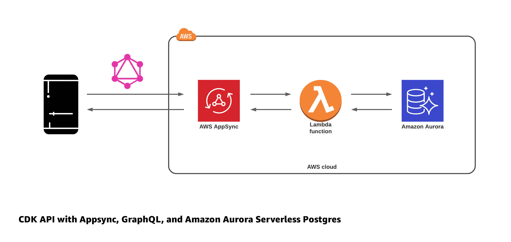

# CDK API with GraphQL and Aurora Serverless PostgreSQL

This CDK stack deploys a real-time GraphQL API built with AWS AppSync, Amazon Aurora Serverless PostgreSQL, and AWS Lambda.



## Getting started

To deploy this project, follow these steps.

1. Clone the project

```sh
git clone https://github.com/dabit3/graphql-api-cdk-serverless-postgres.git
```

2. Change into the new directory and install dependencies

```sh
cd graphql-api-cdk-serverless-postgres

npm install
```

3. Change into the __lambda-fns__ directory and install the dependencies for the Lambda function package:

```sh
cd lambda-fns
npm install
cd ..
```

4. Run the build

```sh
npm run build
```

5. Deploy the stack

```sh
cdk deploy --O cdk-exports.json
```

6. Create the posts table

Visit the [RDS dashboard](https://console.aws.amazon.com/rds/home) and click on __Query Editor__. From the dropdown menu, choose the database (it should begin with __appsynccdkrdsstack-aurorablogcluster__).

For the Database username, choose __Connect with a Secrets Manager ARN__.

To sign in, you will need the ARN from the secret that was created by CDK. To get this secret, in a new window open [AWS Secrets manager](https://console.aws.amazon.com/secretsmanager/home). Here, click on the secret that was created by CDK (it should start with __AuroraBlogClusterSecret__). Copy the Secret ARN to your clipboard and go back to the RDS Query Editor.

Next, use the __Secret ARN__ as the __Secrets Manager ARN__ and __BlogDB__ as the name of the database. Next, press enter and click on Connect to Database.

Once signed in, create the __posts__ table by executing the following query:

```sql
CREATE TABLE posts (
 id text UNIQUE,
 title text,
 content text
);
```

7. Testing the API

Next, visit the [AppSync console](https://console.aws.amazon.com/appsync/home) and click on __cdk-blog-appsync-api__ to view the dashboard for your API.

Next click on __Queries__ in the left hand menu to view the query editor. From here, we can test out the API by running the following queries and mutations:

```graphql
mutation createPost {
  createPost(post: {
    id: "001"
    title: "My first post!"
    content: "Hello world!"
  }) {
    id
    title
    content
  }
}

query listPosts {
  listPosts {
    id
    title
    content
  }
}

query getPostById {
  getPostById(postId: "001") {
    id
    title
    content
  }
}

mutation updatePost {
  updatePost(post: {
    id: "001"
    title: "My updated post!"
  }) {
    id
    title
  }
}

mutation deletePost {
  deletePost(postId: "001")
}
```